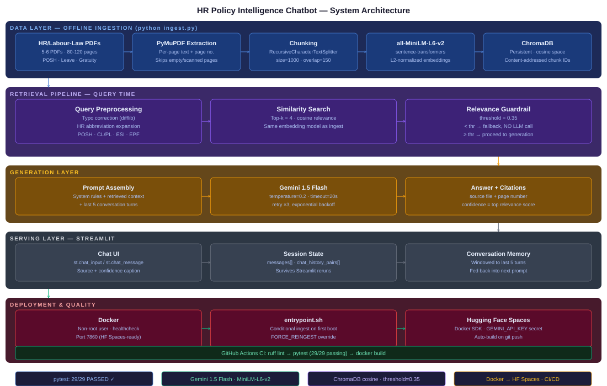

# 🤖 HR Policy Intelligence Chatbot — RAG-Powered HR & Labour Law Q&A

[](https://github.com/narendrakalam2001/hr-policy-rag-chatbot/actions)
[](https://python.org)
[](https://langchain.com)
[](https://ai.google.dev)
[](https://www.trychroma.com)
[](https://streamlit.io)
[](https://docker.com)
[](tests/)
[](LICENSE)

> **Domain:** HR Tech / Enterprise GenAI
> **Problem:** Retrieval-Augmented Generation — answer employee HR/labour-law questions grounded strictly in company policy documents, with source citation
> **Knowledge Base:** Indian labour law + HR policy PDFs — Leave Policy, Gratuity Act, Maternity Benefit Act, POSH Policy, Shops & Establishments Act (5-6 docs · 80-120 pages)
> **Industry Context:** Accenture · TCS · Infosys — 100k+ employee organizations run internal HR chatbots on exactly this RAG-over-internal-docs architecture

---

## 💡 Why This Project Matters

Employees at large enterprises re-ask the same handful of HR policy questions — leave entitlement, gratuity eligibility, POSH procedure — and HR teams field 100+ repetitive queries a day that a grounded chatbot can resolve in seconds. This system simulates a production-grade internal HR RAG assistant:

- **PyMuPDF** extracts per-page text from policy PDFs, preserving page numbers for citation-grade traceability
- **sentence-transformers (all-MiniLM-L6-v2)** embeds chunks locally — no per-query embedding API cost
- **ChromaDB** persists the vector store with cosine similarity space, so retrieval scores are a meaningful 0–1 confidence value
- A **relevance guardrail runs before the LLM call**, not after — an out-of-scope question never reaches Gemini, avoiding both hallucination risk and wasted API spend
- **Gemini 3.6 Flash** generates the final answer strictly from retrieved context, with mandatory source-file + page-number citation and a 5-turn conversation memory window

This mirrors how real enterprise HR chatbots are built: cheap local retrieval doing the heavy lifting, the paid LLM call reserved only for genuinely in-scope questions.

---

## ⚙️ System Configuration & Quality

| Component | Value |
|---|---|
| **LLM** | Gemini 3.6 Flash — temperature=0.2, timeout=20s, retry ×3 |
| **Embedding model** | all-MiniLM-L6-v2 (sentence-transformers, local, free) |
| **Vector store** | ChromaDB — persistent, cosine similarity space |
| **Chunking** | RecursiveCharacterTextSplitter — size=1000, overlap=150 |
| **Retrieval** | top-k=4, relevance threshold=0.35 (guardrail cutoff) |
| **Conversation memory** | Last 5 turns, windowed |
| **Test suite** | **30 / 30 passing** — hermetic (FakeEmbeddings, no API key/network needed) |
| **Lint** | `ruff check .` — clean |
| **Guardrail behaviour** | Out-of-scope queries never trigger a Gemini call (verified in `tests/test_llm_chain.py`) |

---

## 🔗 Live Links

| Service | URL |
|---|---|
| 🚀 **Chatbot (Hugging Face Space)** | _add your Space URL here after deploying (see below)_ |
| 📓 **EDA / Corpus Exploration Notebook** | [notebooks/hr_policy_eda.ipynb](notebooks/hr_policy_eda.ipynb) |
| 🧪 **CI Runs** | [GitHub Actions](https://github.com/narendrakalam2001/hr-policy-rag-chatbot/actions) |

> ⚠️ Hugging Face Spaces free tier: first request after inactivity may take 15-30 seconds (cold start / sleep).

---

## 🏗️ System Architecture



**Design decisions worth calling out in an interview:**

- **Guardrail before the LLM call, not after.** If retrieval relevance is below threshold, the app returns the fallback message directly — Gemini is never called for clearly out-of-scope questions. This avoids both hallucinated answers and wasted API calls/latency.
- **Content-addressed chunk IDs.** Each chunk's ID is a hash of `(source_file, page_number, chunk_index)`, so re-running ingestion after adding or editing a PDF upserts rather than duplicates — ingestion is safe to run repeatedly.
- **Cosine similarity space is set explicitly** on the Chroma collection (embeddings are L2-normalized), so the relevance score shown as "confidence" in the UI is a meaningful 0–1 value, not a raw distance.
- **Conversation memory is a plain bounded list**, not a LangChain memory object — it's trivial to serialize into Streamlit's `session_state` and easy to explain end-to-end.

---

## 🧠 Technical Standards

| Component | Implementation |
|---|---|
| **PDF Parsing** | PyMuPDF (`fitz`) — per-page extraction, skips empty/scanned pages gracefully |
| **Chunking** | RecursiveCharacterTextSplitter — size=1000, overlap=150, metadata-preserving |
| **Embeddings** | all-MiniLM-L6-v2 — L2-normalized, local inference (zero embedding API cost) |
| **Vector Store** | ChromaDB — persistent, `hnsw:space=cosine`, content-addressed idempotent upserts |
| **Query Preprocessing** | Domain-vocabulary typo correction (difflib) + HR abbreviation expansion (POSH, CL/PL, ESI, EPF) — deliberately not a general spellchecker, to avoid mangling domain terms |
| **Guardrail** | Relevance threshold=0.35 — short-circuits before any LLM call on out-of-scope queries |
| **Prompt Engineering** | System prompt enforces grounding, mandatory citation format, explicit refusal behaviour |
| **LLM Robustness** | Configurable request timeout + exponential-backoff retry (tenacity) — bounds hangs on network issues |
| **Conversation Memory** | Explicit bounded `(user, assistant)` list, windowed to last 5 turns |
| **Testing** | pytest — 30 tests, hermetic (FakeEmbeddings), no API key or network dependency |
| **CI/CD** | GitHub Actions — ruff lint → pytest → Docker build, on every push |
| **Containerization** | Docker — non-root user, healthcheck, conditional ingestion entrypoint |
| **Deployment** | Hugging Face Spaces (Docker SDK) |

---

## 📁 Project Structure

```
hr-policy-rag-chatbot/
│
├── app/                                   # Core RAG system
│   ├── rag_pipeline.py                    # PDF ingestion + chunking + ChromaDB store
│   ├── vector_store.py                    # Query preprocessing + retrieval + relevance scoring
│   ├── llm_chain.py                       # Gemini integration, RAG orchestration, memory, guardrails
│   └── prompt_templates.py                # System prompt + prompt assembly
│
├── tests/                                 # 30 pytest unit tests — all passing
│   ├── conftest.py                        # Shared fixtures (sample PDF, FakeEmbeddings)
│   ├── test_rag_pipeline.py               # PDF discovery, extraction, chunking, ingestion
│   ├── test_vector_store.py               # Query preprocessing, retrieval, guardrail logic
│   ├── test_prompt_templates.py           # Prompt assembly and formatting
│   └── test_llm_chain.py                  # RAGChatbot orchestration (LLM call stubbed)
│
├── notebooks/
│   └── hr_policy_eda.ipynb                # Corpus exploration — page/chunk stats, sample chunks
│
├── docs/
│   └── architecture/
│       └── hr_policy_system_architecture.svg   # 5-layer system architecture diagram
│
├── data/
│   └── policies/                          # PDF files go here
│
├── streamlit_app.py                       # Chat UI — session state, source citation, confidence
├── ingest.py                              # Ingestion runner script
├── config.py                              # Centralized settings (env-driven)
├── entrypoint.sh                          # Container startup: conditional ingest + launch
├── Dockerfile                             # Production image — non-root, healthcheck, port 7860
├── .dockerignore
├── .gitignore
├── .github/workflows/ci.yml               # GitHub Actions — lint + test + Docker build
├── requirements.txt                       # Production dependencies
├── requirements-dev.txt                   # Test/lint-only dependencies
├── .env.example                           # Environment variable template
├── BEGINNER_SETUP_GUIDE.md                # Full beginner walkthrough (run → push → deploy)
└── README.md                              # This file
```

---

## 🚀 Quickstart

### 1. Clone & Install

```bash
git clone https://github.com/narendrakalam2001/hr-policy-rag-chatbot.git
cd hr-policy-rag-chatbot
python -m venv venv && source venv/bin/activate   # Windows: venv\Scripts\activate
pip install -r requirements.txt
```

### 2. Add Your Gemini API Key

```bash
cp .env.example .env
# edit .env → set GEMINI_API_KEY (free key: https://aistudio.google.com/app/apikey)
```

### 3. Add Policy PDFs

Place your HR policy / labour law PDFs in `data/policies/` (Leave Policy, Gratuity Act, Maternity Benefit Act, POSH Policy, Shops & Establishments Act — public government/HR-template PDFs work well).

### 4. (Optional) Explore the Corpus

```bash
jupyter notebook notebooks/hr_policy_eda.ipynb
```

### 5. Ingest the Knowledge Base

```bash
python ingest.py
```

Expected output:
```
INFO  Discovered 5 PDF(s) in data/policies
INFO  Extracted N non-empty page(s) from <file>.pdf
INFO  Built N chunk(s) from N page(s)
INFO  Ingestion complete. Collection now has N chunk(s) total.
✅ Ingestion succeeded. Collection contains N chunk(s).
```

### 6. Run the Chatbot

```bash
streamlit run streamlit_app.py
# → http://localhost:8501
```

### 7. Run Tests

```bash
pip install -r requirements-dev.txt
pytest -v
# 30 passed
```

The test suite uses `FakeEmbeddings` in place of the real embedding model, so it runs fast, offline, and without a Gemini key — it validates chunking, metadata, Chroma persistence/idempotency, query preprocessing, guardrail logic, and prompt assembly. The Gemini call itself is stubbed in `tests/test_llm_chain.py` rather than hit live, keeping CI free and fast.

---

## 🐳 Docker

```bash
docker build -t hr-policy-chatbot .
docker run -p 7860:7860 --env-file .env hr-policy-chatbot
```

The entrypoint runs `ingest.py` automatically on first start if no vector store is found (set `FORCE_REINGEST=true` to rebuild it on a later start).

---

## ☁️ Deploying to Hugging Face Spaces

1. Create a new Space → **SDK: Docker**.
2. In Space **Settings → Repository secrets**, add `GEMINI_API_KEY`.
3. Push this repo to the Space's git remote.
4. The Space builds the Dockerfile and serves on port 7860 automatically.

Full beginner-level command-by-command instructions (Command Prompt, GitHub push, Hugging Face deploy) are in [BEGINNER_SETUP_GUIDE.md](BEGINNER_SETUP_GUIDE.md).

---

## 🛡️ Ethical & Practical Considerations

- This assistant provides **informational summaries of policy documents, not legal advice** — the system prompt explicitly instructs the LLM to say so when a question needs legal judgment on a specific personal situation.
- Answers are grounded **only** in the ingested PDFs — if your knowledge base is incomplete or outdated, the chatbot will confidently answer from stale policy text. Re-run `python ingest.py` whenever source PDFs change.
- Retrieval quality depends on clean PDF text extraction — scanned PDFs without an OCR text layer yield zero usable chunks (see `EmptyKnowledgeBaseError` in `app/rag_pipeline.py`); check this with the EDA notebook before assuming ingestion "worked."
- Query preprocessing uses a small hand-built HR vocabulary for typo correction/abbreviation expansion rather than a general spellchecker — intentional, to avoid "correcting" domain terms into unrelated words, but only known abbreviations are expanded.
- The relevance-score guardrail threshold (`RETRIEVAL_SCORE_THRESHOLD=0.35`) was validated against synthetic test content, not a final real-world knowledge base — re-tune it once your actual policy PDFs are ingested, using the EDA notebook's chunk-length stats as a starting signal.
- The live Gemini API call path has been **verified end-to-end on a real knowledge base** (real HR/labour-law PDFs, 148 pages, 370 chunks) with a working Gemini API key — retrieval, guardrail, generation, source citation, and confidence scoring all confirmed working together in the live Streamlit app.
- **LLM model names go stale fast.** Google regularly deprecates and shuts down older Gemini model IDs (e.g. `gemini-1.5-flash` was fully retired in 2026, returning a 404 for every request — this project originally shipped with it and was updated to `gemini-3.6-flash` after hitting exactly that). If the chatbot suddenly starts failing with "Gemini API error" after previously working, check [ai.google.dev/gemini-api/docs/models](https://ai.google.dev/gemini-api/docs/models) for the current stable model ID and update `GEMINI_MODEL` in `.env` — this is an operational maintenance task, not a bug in this codebase.

---

## 👨‍💻 About

**Narendra Kalam** — MSc Computer Science (Gold Medalist — NASSCOM, Full Stack Data Science + AI)

> Building 20+ industry-level, end-to-end ML/AI systems across all domains.

[](https://www.linkedin.com/in/narendra-kalam/)
[](https://www.kaggle.com/narendrakalam)
[](https://narendrakalam2001.github.io/)
[](mailto:kalamnarendra2001@gmail.com)

### Portfolio Projects

| # | Project | Domain | Champion Model / Core Tech | Key Metric |
|---|---|---|---|---|
| 1 | Credit Card Fraud Detection | BFSI / Fintech | ExtraTrees | F1 = 0.8962 · 284K transactions |
| 2 | Credit Risk Prediction | BFSI / Lending | LightGBM | F1 = 0.9741 · ROC-AUC = 0.9991 |
| 3 | Customer Churn Prediction | Telecom / BFSI | CatBoost | F1 = 0.634 · Recall = 0.7312 |
| 4 | House Price Prediction | Real Estate | CatBoost | RMSE = $20,128 · R² = 0.9053 |
| 5 | Store Sales Forecasting | Retail / Supply Chain | LightGBM (Ensemble) | RMSLE = 0.3739 · R² = 0.9761 |
| 6 | Energy Demand Forecasting | Energy / Utilities | ElasticNet | RMSE = 712.04 MW · R² = 0.9759 |
| 7 | Stock Price & Risk Forecasting | Fintech / Capital Markets | Ridge | DirAcc = 53.44% · Sharpe = 0.80 |
| 8 | Resume Screener AI | HR Tech | LightGBM | F1 = 0.7608 · Top-3 = 0.9416 |
| 9 | ABSA Sentiment Analysis | E-Commerce / Banking | RidgeClassifier | Macro-F1 = 0.6212 · ROC-AUC = 0.823 |
| 10 | Fake News Detector | Media Tech / Gov Tech | XGBoost | F1 = 0.9993 · ROC = 1.0000 |
| 11 | BC5CDR Clinical NER | Biomedical NLP | BioBERT | F1 = 0.8847 · Chemical F1 = 0.9239 |
| 12 | News Topic Modeling | Media Analytics | LDA (Gensim) | Cv = 0.6225 · Diversity = 0.92 |
| 13 | Chest X-Ray Diagnosis | Healthcare AI | DenseNet121 | Mean AUC = 0.7864 · 14 classes |
| 14 | **HR Policy Intelligence Chatbot** | **HR Tech / Enterprise GenAI** | **Gemini 3.6 Flash + RAG** | **30/30 tests · guardrail threshold=0.35** |

---

## 📚 References

- Lewis et al. (2020) — [Retrieval-Augmented Generation for Knowledge-Intensive NLP Tasks](https://arxiv.org/abs/2005.11401)
- Reimers & Gurevych (2019) — [Sentence-BERT: Sentence Embeddings using Siamese BERT-Networks](https://arxiv.org/abs/1908.10084)
- ChromaDB Documentation — [trychroma.com](https://www.trychroma.com)
- Google Gemini API Documentation — [ai.google.dev](https://ai.google.dev)

---

## 📄 License

MIT License — see [LICENSE](LICENSE)